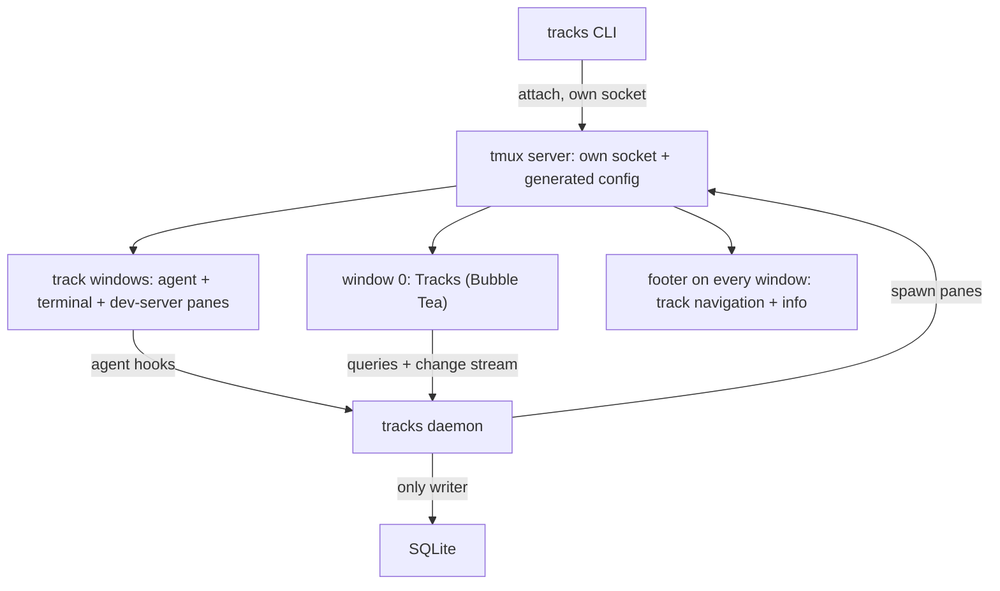

# Tracks v2 masterplan

Tracks v2 is the next major version of Tracks: a user-friendly terminal app that runs CLI agents (Claude Code, Cursor) in isolated worktrees, with one always-present **Tracks** window as the command center and one window per track.

This file is the single source of truth for direction, decisions and status. Implementation detail lives in feature plans under [`plans/`](plans/).

## How these docs work

- **`masterplan.md`** (this file) holds the goal, decisions, rules and the chunk list. It is updated whenever a decision changes, and it stays until the v2.0.0 release.
- **`plans/NN-<name>.md`** is the implementation plan for one chunk: tasks, tests, PR slices. It is written when the chunk is designed, and **deleted in the PR that completes the chunk**, since git history keeps it. Knowledge that stays useful moves into code docs (`doc.go`, section `AGENTS.md`).
- **`plans/drafts/`** holds designs already worked out for later chunks. A draft becomes a feature plan when its chunk comes up.

## Chunks

| # | Chunk | Plan | Status |
|---|---|---|---|
| 1 | Technical groundwork: `--new-app`, isolation, `internal/v2` skeleton, dedicated tmux server, Charm v2 TUI stack, design tokens, demo session | [01-technical-groundwork.md](plans/01-technical-groundwork.md) | done |
| 2 | Global app layout: Tracks window (placeholder), track windows, footer navigation, menus, on demo data | [02-app-layout.md](plans/02-app-layout.md) | in progress |
| 3 | Tracks window layout: banner and tab navigation, no tab content yet | — | done |
| 4 | Storage: SQLite, list queries, auto-archive, change stream | [drafts/storage.md](plans/drafts/storage.md); repos in [03-repositories.md](plans/03-repositories.md) | started: repos |
| 5 | Real tracks: v2 daemon, agents, create/end/resume, supervision | not written yet | to be designed |
| 6 | Agent hooks instead of screen polling | [drafts/hooks.md](plans/drafts/hooks.md) | draft |
| 7 | Tracks window content: tabs (Station, Repositories, Proxy, Engines, Settings), track actions | Repositories in [03-repositories.md](plans/03-repositories.md), Settings in [04-settings.md](plans/04-settings.md) | started: Station, Repositories, Settings |
| 8 | v2.0.0 release: delete v1, move `internal/v2` up, drop flag and build tag | not written yet | later |

Chunks 1 to 3 come first. Chunk 3 started before chunk 2's data interface and popups, which follow it. Chunk 2 uses placeholder statuses; the [track status model](#track-status-to-be-designed) is designed before chunk 3, or chunk 3 uses placeholders too. After chunk 3, the order of 4 to 7 is decided by what the layout work shows.

## Decisions

- **v2 is a release milestone, not a separate codebase.** It lives in this repo on `main`, next to v1, and is tagged v2.0.0 when done. It doesn't need to be compatible with v1 data or config; importing v1 tracks is undecided.
- **Engine: tmux stays.** It renders agent TUIs faithfully, splits panes next to an agent, keeps sessions alive when the UI closes, and works over SSH.
- **Dedicated tmux server:** v2 runs on its own socket with a config it generates. The user's personal `~/.tmux.conf` and other sessions are never involved.
- **Start from a plain terminal:** started inside another tmux, Tracks refuses with a clear message instead of nesting. The prefix stays Ctrl+b.
- **UI: Charm v2** (`charm.land/bubbletea/v2`, `lipgloss/v2`, `bubbles/v2`, `huh/v2`, `bubblezone/v2`). The import paths differ from v1's, so both coexist in one `go.mod`.
- **The Tracks window is window 0,** always present, the command center with tabs. v2 has no Dashboard or Main window.
- **Track navigation: a fixed footer** (the tmux status line) on every window, with clickable track slots, first/previous/next/last buttons, attention badges and keyboard shortcuts. Hover is not possible in the tmux status line and is accepted as missing.
- **Popups:** a full menu and a quick switcher.
- **Tracks keys sit behind the tmux prefix** (`Ctrl+b t`, ...). A key bound without it is taken from every pane, and agents and shells use most Alt keys: Claude Code has `Alt+t` (thinking), `Alt+p` (model), `Alt+o`, `Alt+b`/`f`/`d`, `Alt+y`; shells have `Alt+.` (last argument), `Alt+<`/`Alt+>` (history), `Alt+t`, Alt+digits.
- **Storage: SQLite** (pure Go, `modernc.org/sqlite`) for tracks, history and the event timeline. `config.yaml` stays a hand-edited YAML file.
- **Agent status from hooks,** not screen polling, with a narrow polling fallback. One direction for now: agent to Tracks.
- **Colours only through design tokens:** app code names what a colour is for (`text.muted`, `bg.hover`, `state.danger.text`), never the colour itself. A theme assigns a value to every token. Themes and colour values are kept apart from app code. The first theme ships with the binary; loading user theme files comes later.
- **Theme values are exact `#rrggbb` colours,** with a dark and a light variant per token. Tracks has its own look instead of following the terminal's colour scheme. Terminals without 24-bit colour (older macOS Terminal.app, the Linux console) get the nearest colour they support: Lip Gloss and tmux convert automatically.
- **The layout is proven on fake data first:** `./tracks --new-app --demo` opens a playground with fake tracks. The UI is built in its real packages against a data interface, so the playground becomes the product.

## Target shape



## v1 and v2 on `main`

v1 keeps shipping from `main`, with urgent fixes at any time, while v2 is merged step by step. Rules:

- **Separate tree:** all v2 code lives under `internal/v2/`, including its own CLI root. Everything outside it is v1.
  - v2 PRs don't change v1 packages. The exceptions are small guard fixes, and moving library-neutral helpers into shared packages.
  - v1 fixes don't touch `internal/v2/`.
- **Reuse of v1 packages:** v2 may import stable v1 leaf packages unchanged (`git`, `shellx`, `ports`, ...). If v2 needs different behaviour, it copies the package into `internal/v2/` and changes the copy.
- **Release binaries contain no v2:** v2 is only linked in with the `v2` build tag (`make dev`). Releases, `make build` and `tracks update` stay pure v1. `go test ./...` still tests the v2 packages.
- **Runtime isolation in v2 mode:**
  - separate config, data directory, daemon socket and tmux server
  - namespaced global helper files, and a separate proxy port range
  - a v2 session never touches the installed v1 app, and vice versa
- **Dependencies:** v2-only dependencies don't affect v1. Bumping a dependency v1 also uses needs green v1 tests.
- **CI** runs the full suite on every PR.
- **At v2.0.0:** v1 code is deleted, `internal/v2/*` moves up one level in one mechanical commit, and the build tag and `--new-app` flag are removed.

## Architecture and conventions

**Status: DRAFT, to be agreed.** Every new package group, and every `AGENTS.md`, is proposed and agreed before it's created.

### Principles

- **One package, one purpose,** describable in one sentence without "and".
- **Files around 400 lines at most.** Past that, split by responsibility. It's a prompt to rethink, not a hard rule. v1's 1,000 to 1,600-line files (`state.go`, `handlers.go`, `dashboard.go`, `supervisor.go`, `settings.go`) are the counter-example.
- **Reuse when there's a second real caller,** not in advance. Interfaces are small and live where they're consumed.
- **Pure core, thin edges:** decisions (track lifecycle, hook mapping, footer layout, startup plan) are pure functions over plain data. Side effects (tmux, git, SQLite, processes) sit at the edges behind small interfaces.
- **Tests where bugs hurt:**
  - Always tested: pure decisions, store queries and migrations, config parsing, protocol encoding.
  - Tested once against a real process: tmux and git, on throwaway servers and repos.
  - Not tested line by line: glue code and simple views. A few key screens get golden snapshots.
- **Agent-friendly, briefly:**
  - One root `AGENTS.md` (about one page): the v1/v2 split in its first lines, the architecture map, dependency rules, build and test commands, conventions.
  - Section-level `AGENTS.md` files (for example `internal/v2/ui/`) only where the code doesn't make the rules obvious. Each has the same shape (purpose, entry points, rules, how to test) and stays under about 40 lines.
  - Package doc comments (`doc.go`) say what a package does. `CLAUDE.md` imports `AGENTS.md`, so every agent reads the same text.

### Draft layout

Imports only point downwards.

```text
internal/v2/
  cli/               thin CLI commands: parse flags, call a service or RPC, print
  app/               composition root: the only place that wires implementations together
  daemon/            process lifecycle, socket server, routing requests to services
  rpc/               request/response types + client, shared by CLI, UI and daemon
  tracks/            use cases: create, end, promote, resume, archive
  track/             domain: Track, Status, Kind, lifecycle transitions (pure, imports nothing internal)
  store/             SQLite: schema, migrations, queries
  agents/            Provider interface; claude/ and cursor/: spawn command, hook install, event mapping
  hooks/             `tracks hook`: payload parsing into domain events
  supervise/         per-track liveness and fallback checks
  tmux/              client with socket, generated config, tmuxtest helper
  trackwin/          a track's window: agent pane, right column of terminal and dev-server panes
  footer/            footer rows rendered as tmux format strings (pure)
  sysinfo/           what the footer shows about the machine: LAN, WAN, CPU, memory
  workspace/         worktrees and provisioning
  devservers/        dev servers, proxy, ports
  config/ platform/  v2 config schema; paths, profile, shell and log helpers
  theme/             design tokens, theme values and loading (no UI library imports)
  ui/
    style/           Lip Gloss and Huh styles built from theme tokens
    widget/          shared UI pieces, only once 2+ screens use them
    source/          Source interface for UI data; demo and daemon implementations
    tracksview/      the Tracks window (not `tracks/`, which is too close to the `track` domain package)
    themecreator/    theme editor: every token with preview and dark/light values
    menu/ switcher/  popups
  demo/              fake tracks and the fake agent for the playground
```

**Dependency rules:**
- `track` imports nothing internal.
- `ui` reaches data only through `ui/source` and `rpc`.
- Colours come only from `theme` tokens. A test fails on colour literals anywhere else in `internal/v2`.
- Only `app` wires concrete implementations.

**Reused from v1, unchanged at first:** `git`, `provision`, `services`, `proxy`, `ports`, `github`, `notify`, `update`, `usage`, `shellx`, `dlog`.

## Track status (to be designed)

The footer, the Tracks window, notifications and storage all depend on it, so it has to be designed before real tracks are built. Requirements:

- **Defined exactly once:** one place in the `track` domain package declares every status value with its label, colour token, priority and whether it needs attention. Footer, screens, notifications and storage read from there and never list statuses themselves.
- **Easy to extend:** adding a status value is one new entry in that place, plus its tests.
- **Combined, not one flat list:** a track can be in several states at once (for example its agent waits for you while its PR is open), and what's shown is derived from them.
- **Nothing is carried over from v1:** v1's statuses are not a starting point.

## Open questions

- **Naming:** railroad terms for app concepts, used the same way in the UI, commands, code and docs. Proposals so far: **engine** for an agent CLI (Claude, Cursor; the settings section "Engines"), **stationed** (or **parked**) for a finished track, **Back on track** to resume one, **Depot** for archived tracks. Plain words stay where users must react quickly (needs approval, errors). This goes into a glossary here once agreed.
- **Track list tab:** named **Station** (decided in chunk 3). Other tabs: Repositories, Proxy, Engines, Settings.
- **Tracks window:** what Enter does on a track (open an action panel or switch to its window), and where details are shown. To be decided in chunk 3 or 7, informed by the playground.
- **v1 data:** fresh start, or a read-only import into History at release.
- **Final paths at release:** keep the `-v2` names or take over the plain ones.
- **Hover in the footer:** is it worth a Bubble Tea footer pane per window? This is decided after trying the tmux footer in chunk 2.
- **Terminal padding:** terminals like Ghostty draw their own padding in their background colour, a frame around Tracks. Options: document `window-padding-color = extend`, or have Tracks set the terminal background with OSC 11 while it runs.
- **The v1 menu rebuild** (uncommitted, Charm v1, on the `tracks/09ad3c-menu` branch): ship it to v1 too, or keep it only as the reference for the v2 menu.

## Risks

- **Nested tmux:** users who start Tracks inside their own tmux are refused and have to open a new terminal tab. This is a deliberate trade-off.
- **Server environment:** the Tracks tmux server inherits PATH and other variables from the terminal that starts it first.
- **The generated tmux config is opinionated.** Overrides go only through a sourced override file.
- **Agent hook payloads drift** between CLI versions. Hooks read only named fields and fall back to polling.

## Follow-ups

Known gaps left on purpose, each with when it has to be done. Remove an entry in the PR that fixes it.

- **Database permissions:** `tracks.db` and its folder are readable by other users of the machine (folder 0755, file per umask). Harmless for repo paths; make the folder 0700 and the files (database, WAL, backups) 0600 before prompts, session IDs or costs are stored (chunk 4 or 5).
- **Repo links by name:** running tracks record their repo by name in the `@tracks_repo` window option, so a repo can't be renamed while tracks use it. Switch to the repo ID when tracks move into the database (chunk 4 or 5), then allow renaming.
- **Case-insensitive repo names fold only A–Z:** SQLite's `NOCASE` treats `Über` and `über` as different names. Add a normalized name column if that ever matters.

## Existing work

- [PR #105](https://github.com/bluegardenproject/tracks/pull/105) adds a shared palette to v1 (Charm v1). Its values are a starting point for the first v2 theme.
- The menu rebuild on the `tracks/09ad3c-menu` branch (Charm v1, uncommitted) is the design reference for the v2 menu.
