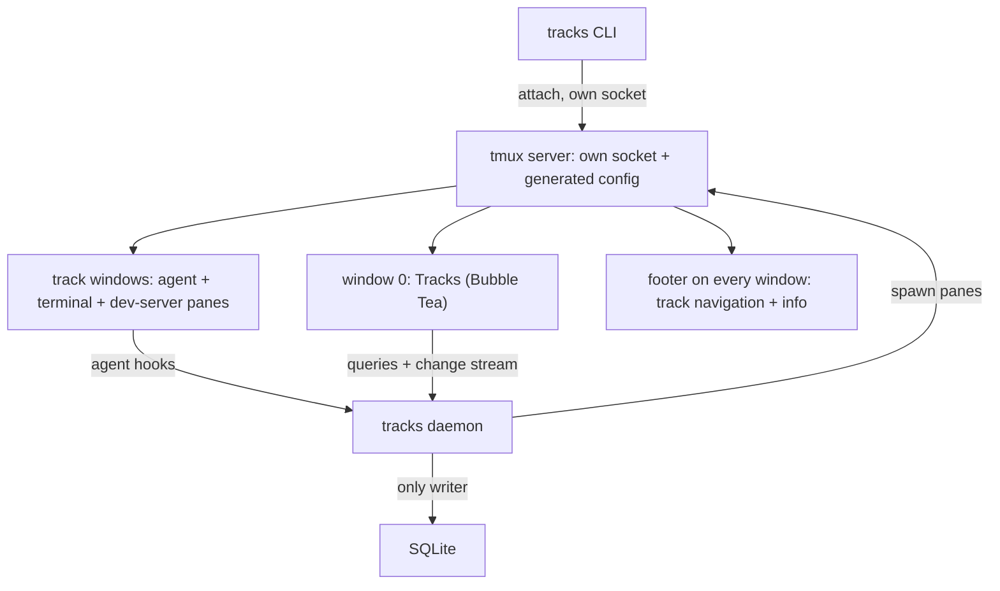

# Tracks v2 masterplan

Tracks v2 is the next major version of Tracks: a user-friendly terminal app that runs CLI agents (Claude Code, Cursor) in isolated worktrees, with one always-present **Tracks** window as the command center and one window per track.

This file is the single source of truth for direction, decisions and status. Implementation detail lives in feature plans under [`plans/`](plans/).

## How these docs work

- **`masterplan.md`** (this file) holds the goal, decisions, rules and the chunk list. It is updated whenever a decision changes, and it stays until the v2.0.0 release.
- **`plans/NN-<name>.md`** is the implementation plan for one chunk: tasks, tests, PR slices. It is written when the chunk is designed, and **deleted in the PR that completes the chunk**, since git history keeps it. Knowledge that stays useful moves into code docs (`doc.go`, section `AGENTS.md`).
- **`plans/drafts/`** holds designs already worked out for later chunks. A draft becomes a feature plan when its chunk comes up.

## Chunks

| # | Chunk | Plan | Status |
|---|---|---|---|
| 1 | Technical groundwork: `--new-app`, isolation, `internal/v2` skeleton, dedicated tmux server, Charm v2 TUI stack, design tokens, demo session | [01-technical-groundwork.md](plans/01-technical-groundwork.md) | done |
| 2 | Global app layout: Tracks window (placeholder), track windows, footer navigation, menus | [02-app-layout.md](plans/02-app-layout.md); popups in [06-add-track.md](plans/06-add-track.md) | in progress |
| 3 | Tracks window layout: banner and tab navigation, no tab content yet | — | done |
| 4 | Storage: SQLite, list queries, auto-archive, change stream | repos in [03-repositories.md](plans/03-repositories.md); the storage draft and plans 11 to 13 (archive, auto-archive and filters; change stream and Derail; Archive replacing Clean) are in git history | done |
| 5 | Real tracks: v2 daemon, agents (with v1's prompts, see Decisions), create/end/resume, supervision | the creation form's layout in [06-add-track.md](plans/06-add-track.md); creating tracks in [07-create-track.md](plans/07-create-track.md); resuming and cleaning in [08-resume-and-clean.md](plans/08-resume-and-clean.md), Clean since replaced by Archive; default agents and models per track type in [09-track-type-defaults.md](plans/09-track-type-defaults.md); the commands the prompts promise in [14-tracks-commands.md](plans/14-tracks-commands.md); supervision in [15-supervision.md](plans/15-supervision.md); notifications in [16-notifications.md](plans/16-notifications.md) | started: form layout; creating, ending, resuming and archiving tracks; defaults per track type; the `tracks` commands and helpers; supervision; notifications |
| 6 | Agent hooks instead of screen polling | [drafts/hooks.md](plans/drafts/hooks.md); the hooks for status in [10-track-status.md](plans/10-track-status.md) | started: track and PR status from hooks |
| 7 | Tracks window content: tabs (Station, Repositories, Engines, Settings), track actions | Repositories in [03-repositories.md](plans/03-repositories.md), Settings in [04-settings.md](plans/04-settings.md), Engines in [05-engines.md](plans/05-engines.md), Settings → Tracks in [09-track-type-defaults.md](plans/09-track-type-defaults.md) | started: Station, Repositories, Settings |
| 8 | v2.0.0 release: delete v1, move `internal/v2` up, drop flag and build tag, Homebrew install | not written yet | later |

Chunks 1 to 3 come first. Chunk 3 started before chunk 2's data interface and popups, which follow it. Chunk 2 uses placeholder statuses; the [track status model](#track-status) is designed before chunk 3, or chunk 3 uses placeholders too. After chunk 3, the order of 4 to 7 is decided by what the layout work shows.

## v2.0.0 scope

What v1 does that v2 still lacks, and whether v2.0.0 needs it. Compared with v1's commands, daemon, config and dashboard.

Needed before v2.0.0:

- **Model in the New Track form:** pick the model per track, next to the engine; the type's default preselected.
- **Failed creations kept as drafts** ([17-drafts.md](plans/17-drafts.md)): a creation that fails keeps what was typed, to start it again from Station.
- **The findings from testing:** the folder trust prompt, Cursor's `create-chat` under a custom `XDG_CONFIG_HOME`, Cursor's plan-approval dialog, the overlay colours.

After v2.0.0:

- **Proxy and dev servers, one topic of their own:** the Proxy tab, `tracks up`/`down`/`services`/`url` and the repos' `services` config. v1's proxy UI and UX didn't work, so this is redesigned rather than ported.
- **Worktree setup:** v1's dependency install, copying ignored files (`.env`) into new worktrees, and submodules.

Not needed: v1's scripting commands (`ls`, `new`, `attach`, `done`, `kill`, `forget`, `gc`), which the Tracks window, Archive, Derail and auto-archive replace, and the branch types, which v1 never used. `tracks update` and Homebrew are chunk 8's.

## Decisions

- **v2 is a release milestone, not a separate codebase.** It lives in this repo on `main`, next to v1, and is tagged v2.0.0 when done. It doesn't need to be compatible with v1 data or config; importing v1 tracks is undecided.
- **Engine: tmux stays.** It renders agent TUIs faithfully, splits panes next to an agent, keeps sessions alive when the UI closes, and works over SSH.
- **Dedicated tmux server:** v2 runs on its own socket with a config it generates. The user's personal `~/.tmux.conf` and other sessions are never involved.
- **Start from a plain terminal:** started inside another tmux, Tracks refuses with a clear message instead of nesting. The prefix stays Ctrl+b.
- **UI: Charm v2** (`charm.land/bubbletea/v2`, `lipgloss/v2`, `bubbles/v2`, `bubblezone/v2`). The import paths differ from v1's, so both coexist in one `go.mod`. Forms use Tracks' own widgets, not Huh.
- **The Tracks window is window 0,** always present, the command center with tabs. v2 has no Dashboard or Main window.
- **Track navigation: a fixed footer** (the tmux status line) on every window, with clickable track slots, first/previous/next/last buttons, attention badges and keyboard shortcuts. Hover is not possible in the tmux status line and is accepted as missing.
- **Popups:** Quick Access (`Ctrl+b q`), which replaces the planned full menu, and a quick switcher.
- **Tracks keys sit behind the tmux prefix** (`Ctrl+b t`, ...). A key bound without it is taken from every pane, and agents and shells use most Alt keys: Claude Code has `Alt+t` (thinking), `Alt+p` (model), `Alt+o`, `Alt+b`/`f`/`d`, `Alt+y`; shells have `Alt+.` (last argument), `Alt+<`/`Alt+>` (history), `Alt+t`, Alt+digits.
- **Storage: SQLite** (pure Go, `modernc.org/sqlite`) for tracks and their history. `config.yaml` stays a hand-edited YAML file.
- **Agent status from hooks,** not screen polling, with a narrow polling fallback. One direction for now: agent to Tracks.
- **Colours only through design tokens:** app code names what a colour is for (`text.muted`, `bg.hover`, `state.danger.text`), never the colour itself. A theme assigns a value to every token. Themes and colour values are kept apart from app code. Built-in themes ship with the binary; users add their own as files in the themes folder ([04-settings.md](plans/04-settings.md)).
- **Theme values are exact `#rrggbb` colours,** one per token. A light look is a theme of its own (Default Light), not a variant of every token. Tracks has its own look instead of following the terminal's colour scheme. Terminals without 24-bit colour (older macOS Terminal.app, the Linux console) get the nearest colour they support: Lip Gloss and tmux convert automatically.
- **Agent prompts: v1's text is kept.** v1's prompts work very well, so v2 sends agents the same text v1 sends for the same kind of track, word for word. That covers everything Tracks adds around the user's task:
  - the per-engine task suffixes: Claude's in `internal/claude/spawn.go`, Cursor's in `internal/cursor/prompt.go`
  - the doc-review template and the review candor lines, per engine
  - the shared parts in `internal/agent`: dev servers, terminals, the read-only and draft-PR lines, and the doc write contract, save flow and response style
  - the global helpers v1 installs: the `tracks-reviewer` and `tracks-docs-reviewer` agents and the `tracks-add-repo` skill (`internal/daemon/skill.go`), and the Cursor rule (`internal/daemon/cursorrule.go`)
  - the new-track templates (`internal/tui/newtrack/templates.go`)

  v2 copies these texts unchanged, and a test compares v2's assembled prompts with v1's for the same track, so a drift fails CI; from v2.0.0, when v1 is deleted, golden files take over. Only names that must differ while v1 and v2 run side by side (such as the helpers' file names) may change, and each such change is listed here: the `tracks-reviewer` agent is `tracks-v2-reviewer` in v2, and `tracks-docs-reviewer` is `tracks-v2-docs-reviewer`. Improving a prompt is a decision of its own, discussed and agreed first, never a side effect of other work. Agreed improvements, which the test lists as v2's changes:
  - **Links you cannot read** (`agents.LinksContract`), after the task in every start prompt, both engines: an agent that can't open a linked Jira ticket, Confluence page or other link (MCP missing or not signed in) stops and asks whether to wait for the user to authenticate or to skip the link, instead of planning without it. Claude's Jira sync keeps "non-fatal" for assigning and moving the ticket only.
  - **No dev-server text** (`agents.DevServerContract`) in the work and review prompts until the proxy redesign brings `tracks up` back: v2.0.0 has no dev servers, and the text would send agents to a command that fails.

  Letting users edit the prompts comes later, with v1's text as the default.
- **Install with Homebrew:** `brew install` is offered next to `scripts/install.sh`, by v2.0.0 at the latest. Requirements:
  - The formula installs the release binaries the release workflow already builds and checks against `SHA256SUMS`, and each release updates it automatically.
  - It depends on tmux, so a brew install brings everything Tracks needs to start.
  - A brew-installed Tracks leaves updates to `brew upgrade`: `tracks update` and the update check say so instead of replacing the binary.
- **The layout was proven on fake data first:** a playground (`--demo`) with fake tracks, built in the real packages against a data interface. It was removed once tracks started being created for real.

## Target shape


```mermaid
flowchart TD
    cli["tracks CLI"] -->|"attach, own socket"| server["tmux server: own socket + generated config"]
    daemon["tracks daemon"] -->|"spawn panes"| server
    server --> tracksWin["window 0: Tracks (Bubble Tea)"]
    server --> trackWin["track windows: agent + terminal + dev-server panes"]
    server --> footer["footer on every window: track navigation + info"]
    trackWin -->|"agent hooks"| daemon
    daemon -->|"only writer"| db["SQLite"]
    tracksWin -->|"queries + change stream"| daemon
```

## v1 and v2 on `main`

v1 keeps shipping from `main`, with urgent fixes at any time, while v2 is merged step by step. Rules:

- **Separate tree:** all v2 code lives under `internal/v2/`, including its own CLI root. Everything outside it is v1.
  - v2 PRs don't change v1 packages. The exceptions are small guard fixes, and moving library-neutral helpers into shared packages.
  - v1 fixes don't touch `internal/v2/`.
- **Reuse of v1 packages:** v2 may import stable v1 leaf packages unchanged (`git`, `shellx`, `ports`, ...). If v2 needs different behaviour, it copies the package into `internal/v2/` and changes the copy.
- **Release binaries contain no v2:** v2 is only linked in with the `v2` build tag (`make dev`). Releases, `make build` and `tracks update` stay pure v1. `go test ./...` still tests the v2 packages.
- **Runtime isolation in v2 mode:**
  - separate config, data directory, daemon socket and tmux server
  - namespaced global helper files, and a separate proxy port range
  - a v2 session never touches the installed v1 app, and vice versa
- **Dependencies:** v2-only dependencies don't affect v1. Bumping a dependency v1 also uses needs green v1 tests.
- **CI** runs the full suite on every PR.
- **At v2.0.0:** v1 code is deleted, `internal/v2/*` moves up one level in one mechanical commit, and the build tag and `--new-app` flag are removed.

## Architecture and conventions

**Status: DRAFT, to be agreed.** Every new package group, and every `AGENTS.md`, is proposed and agreed before it's created.

### Principles

- **One package, one purpose,** describable in one sentence without "and".
- **Files around 400 lines at most.** Past that, split by responsibility. It's a prompt to rethink, not a hard rule. v1's 1,000 to 1,600-line files (`state.go`, `handlers.go`, `dashboard.go`, `supervisor.go`, `settings.go`) are the counter-example.
- **Reuse when there's a second real caller,** not in advance. Interfaces are small and live where they're consumed.
- **Pure core, thin edges:** decisions (track lifecycle, hook mapping, footer layout, startup plan) are pure functions over plain data. Side effects (tmux, git, SQLite, processes) sit at the edges behind small interfaces.
- **Tests where bugs hurt:**
  - Always tested: pure decisions, store queries and migrations, config parsing, protocol encoding.
  - Tested once against a real process: tmux and git, on throwaway servers and repos.
  - Not tested line by line: glue code and simple views. A few key screens get golden snapshots.
- **Agent-friendly, briefly:**
  - One root `AGENTS.md` (about one page): the v1/v2 split in its first lines, the architecture map, dependency rules, build and test commands, conventions.
  - Section-level `AGENTS.md` files (for example `internal/v2/ui/`) only where the code doesn't make the rules obvious. Each has the same shape (purpose, entry points, rules, how to test) and stays under about 40 lines.
  - Package doc comments (`doc.go`) say what a package does. `CLAUDE.md` imports `AGENTS.md`, so every agent reads the same text.

### Draft layout

Imports only point downwards.

```text
internal/v2/
  cli/               thin CLI commands: parse flags, call a service or RPC, print
  app/               composition root: the only place that wires implementations together
  daemon/            process lifecycle, socket server, routing requests to services
  rpc/               request/response types + client, shared by CLI, UI and daemon
  tracks/            use cases: create, end, promote, resume, archive
  track/             domain: Track, Status, Kind, lifecycle transitions (pure, imports nothing internal)
  store/             SQLite: schema, migrations, queries
  agents/            Provider interface; claude/ and cursor/: spawn command, hook install, event mapping
  hooks/             `tracks hook`: payload parsing into domain events
  supervise/         per-track liveness and fallback checks
  tmux/              client with socket, generated config, tmuxtest helper
  trackwin/          a track's window: agent pane, right column of terminal and dev-server panes
  footer/            footer rows rendered as tmux format strings (pure)
  sysinfo/           what the footer shows about the machine: LAN, WAN, CPU, memory
  workspace/         worktrees and provisioning
  devservers/        dev servers, proxy, ports
  config/ platform/  v2 config schema; paths, profile, shell and log helpers
  theme/             design tokens, theme values and loading (no UI library imports)
  ui/
    style/           Lip Gloss styles built from theme tokens
    widget/          shared UI pieces, only once 2+ screens use them
    source/          Source interface for UI data, from the daemon and the store
    tracksview/      the Tracks window (not `tracks/`, which is too close to the `track` domain package)
    themecreator/    theme editor: every token with its value, a preview and examples
    quickaccess/     Quick Access popup
    addtrack/        New track form popup
    switcher/        quick switcher popup
```

**Dependency rules:**
- `track` imports nothing internal.
- `ui` reaches data only through `ui/source` and `rpc`.
- Colours come only from `theme` tokens. A test fails on colour literals anywhere else in `internal/v2`.
- Only `app` wires concrete implementations.

**Reused from v1, unchanged at first:** `git`, `provision`, `services`, `proxy`, `ports`, `github`, `notify`, `update`, `usage`, `shellx`, `dlog`.

## Track status

Designed in [10-track-status.md](plans/10-track-status.md): a track status (active, action required, done, closed; error and agent exited from [15-supervision.md](plans/15-supervision.md)) and a PR status, changed only through events. Ended is done; archived is closed. Requirements:

- **Defined exactly once:** one place in the `track` domain package declares every status value with its label, badge (the theme's info state, warning for action required and agent exited, danger for error), priority and whether it needs attention. Footer, screens, notifications and storage read from there and never list statuses themselves.
- **Easy to extend:** adding a status value is one new entry in that place, plus its tests.
- **Combined, not one flat list:** a track can be in several states at once (for example its agent waits for you while its PR is open), and what's shown is derived from them.
- **Nothing is carried over from v1:** v1's statuses are not a starting point.

## Open questions

- **Naming:** railroad terms for app concepts, used the same way in the UI, commands, code and docs. Proposals so far: **engine** for an agent CLI (Claude, Cursor; the settings section "Engines"), **stationed** (or **parked**) for a finished track, **Back on track** to resume one, **Depot** for archived tracks. Plain words stay where users must react quickly (needs approval, errors). This goes into a glossary here once agreed.
- **Track list tab:** named **Station** (decided in chunk 3). Other tabs: Repositories, Engines, Settings; Proxy comes back with the proxy redesign after v2.0.0.
- **Tracks window:** what Enter does on a track (open an action panel or switch to its window), and where details are shown. To be decided in chunk 3 or 7, informed by using it.
- **v1 data:** fresh start, or a read-only import into History at release.
- **Homebrew:** our own tap (`bluegardenproject/tap`) or homebrew-core, which needs a build from source and wider use first. And whether v1 gets the formula before v2.0.0, since the release workflow is shared.
- **Final paths at release:** keep the `-v2` names or take over the plain ones.
- **Hover in the footer:** is it worth a Bubble Tea footer pane per window? This is decided after trying the tmux footer in chunk 2.
- **Terminal padding:** terminals like Ghostty draw their own padding in their background colour, a frame around Tracks. Options: document `window-padding-color = extend`, or have Tracks set the terminal background with OSC 11 while it runs.
- **The v1 menu rebuild** (uncommitted, Charm v1, on the `tracks/09ad3c-menu` branch): ship it to v1 too, or keep it only as the reference for Quick Access.

## Risks

- **Nested tmux:** users who start Tracks inside their own tmux are refused and have to open a new terminal tab. This is a deliberate trade-off.
- **Server environment:** the Tracks tmux server inherits PATH and other variables from the terminal that starts it first.
- **The generated tmux config is opinionated.** Overrides go only through a sourced override file.
- **Agent hook payloads drift** between CLI versions. Hooks read only named fields and fall back to polling.

## Follow-ups

Known gaps left on purpose, each with when it has to be done. Remove an entry in the PR that fixes it.

- **Renaming a repo that tracks use:** tracks now link their repos by ID, but a repo's name and path still can't change while running tracks use it, since their windows and worktrees were made from them. Allow it once repos are written through the daemon.
- **The model a track runs:** Station shows the model picked at creation, "default" for none. A Claude track's transcripts name the model each turn used, so the cost pass can record it and show it instead, including a switch with `/model`. Cursor's default is "auto", which picks per request: show "auto" rather than "default".
- **Case-insensitive repo names fold only A–Z:** SQLite's `NOCASE` treats `Über` and `über` as different names. Add a normalized name column if that ever matters.

## Future features

Ideas worked out far enough to keep, but not planned in any chunk. One moves into a chunk when it's picked up.

- **Event timeline per track:** prompts, approvals, PRs opened and merged, turns and errors, resumes, usage per turn, stored as events from the agent hooks and shown in the track's details. Moved out of chunk 4: its use cases aren't clear yet. Needs a retention setting (`events_retention_days`) if the file grows.
- **History:** a text search on the slug, branch and prompt; filters by repo, track type and engine; paging past the filter's 500 tracks. Moved out of chunk 4 after the first filters.

## Existing work

- [PR #105](https://github.com/bluegardenproject/tracks/pull/105) adds a shared palette to v1 (Charm v1). Its values are a starting point for the first v2 theme.
- The menu rebuild on the `tracks/09ad3c-menu` branch (Charm v1, uncommitted) is the design reference for Quick Access.
